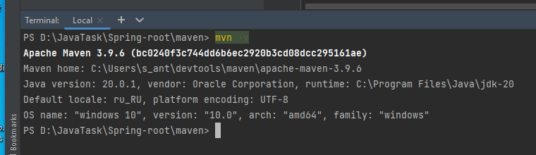

1. Установить себе maven или gradle(если еще не установлена) PS удобно использовать sdkman.
2. С помощью сборщика сгенерировать проект.
3. Выполнить команду по выполнению сборки.
4. Сделать скриншот результатов сборки и прислать в качестве ДЗ.

Установка maven

Генерация проекта

Запуск проекта

